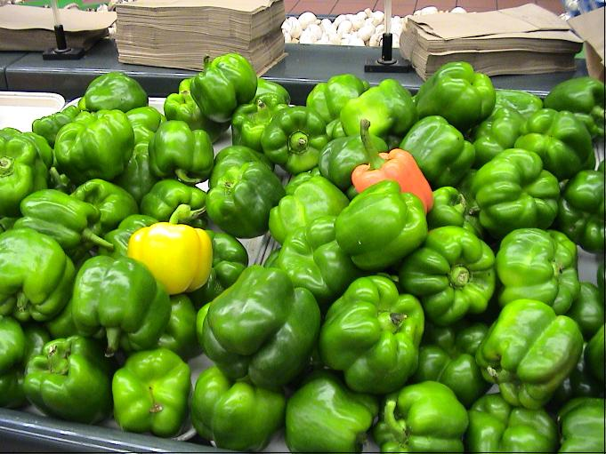
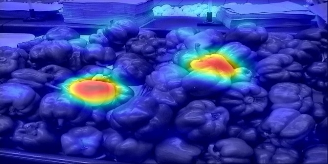

# VisualAttention-Rare2012

Input image
 

Saliency map

**RARE2012 is purely bottom-up using only color and orientation information.**

This is the code written in 2012 by Nicolas Riche during his PhD under the supervision of Matei Mancas. RARE2012 is purely bottom-up using only color and orientation information. It uses neither object detectors like face detection, nor tuning for natural images like centered Gaussians. RARE2012 is faster and better than RARE2007, but the resulting saliency map is more fuzzy. RARE 2012 uses the Simplegabor Toolbox by Jarmo Ilonen and Joni Kämäräinen. In the zip file, the .m files (except from example.m) belong to this toolbox.